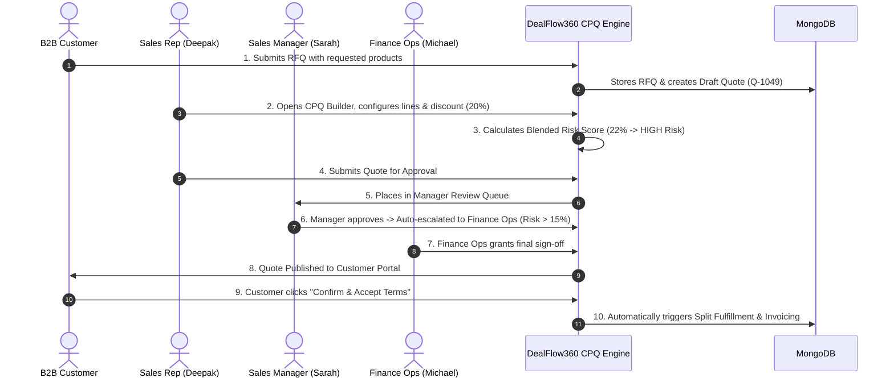
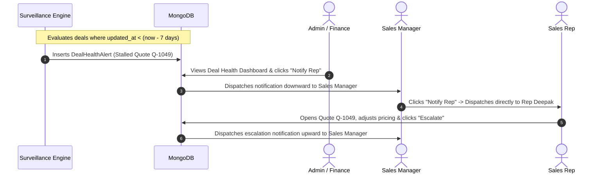

# DealFlow360 — Autonomous B2B CPQ, Deal Governance & Revenue Cloud

[](https://nodejs.org/)
[](https://expressjs.com/)
[](https://reactjs.org/)
[](https://vitejs.dev/)
[](https://www.mongodb.com/)
[](https://tailwindcss.com/)
[](LICENSE)

**DealFlow360** is an enterprise B2B **Configure, Price, Quote (CPQ)**, **Contract Lifecycle Management (CLM)**, and **Autonomous Deal Governance Platform**. It eliminates revenue leakage and pipeline stagnation by uniting real-time product pricing, category margin ceilings, AI-assisted risk scoring, multi-tier approval chains, bi-directional hierarchical notifications, split-warehouse order fulfillment, and subscription billing into a single unified cloud workspace.

---

## 📑 Comprehensive Table of Contents

1. [Executive Summary & Value Proposition](#1-executive-summary--value-proposition)
2. [System Architecture](#2-system-architecture)
3. [Persona & RBAC Permissions Matrix](#3-persona--rbac-permissions-matrix)
4. [Deep Dive: All 19 Server Modules & API Reference](#4-deep-dive-all-19-server-modules--api-reference)
   - [4.1 Auth & Identity (`/api/auth`)](#41-auth--identity-apiauth)
   - [4.2 Users & Sales Teams (`/api/users`)](#42-users--sales-teams-apiusers)
   - [4.3 Customer Accounts (`/api/customers`)](#43-customer-accounts-apicustomers)
   - [4.4 Products & Inventory Catalog (`/api/products`)](#44-products--inventory-catalog-apiproducts)
   - [4.5 Price Lists & Currency Rules (`/api/price-lists`)](#45-price-lists--currency-rules-apiprice-lists)
   - [4.6 Discount Tiers & Margin Ceilings (`/api/discount-tiers`)](#46-discount-tiers--margin-ceilings-apidiscount-tiers)
   - [4.7 Approval Chains & Governance Rules (`/api/approval-chains`)](#47-approval-chains--governance-rules-apiapproval-chains)
   - [4.8 Quotations & CPQ Engine (`/api/quotations`)](#48-quotations--cpq-engine-apiquotations)
   - [4.9 Approvals & Review Queue (`/api/approvals`)](#49-approvals--review-queue-apiapprovals)
   - [4.10 Deal Health & Anomaly Surveillance (`/api/deal-health` / `/api/dashboard`)](#410-deal-health--anomaly-surveillance-apideal-health--apidashboard)
   - [4.11 Hierarchical Notifications (`/api/notifications`)](#411-hierarchical-notifications-apinotifications)
   - [4.12 Customer Portal & Negotiation (`/api/portal` / `/api/negotiation`)](#412-customer-portal--negotiation-apiportal--apinegotiation)
   - [4.13 Multi-Warehouse Fulfillment (`/api/fulfillment`)](#413-multi-warehouse-fulfillment-apifulfillment)
   - [4.14 Warehouses & Stock Locations (`/api/warehouses`)](#414-warehouses--stock-locations-apiwarehouses)
   - [4.15 SaaS Subscriptions & MRR (`/api/subscriptions`)](#415-saas-subscriptions--mrr-apisubscriptions)
   - [4.16 Billing & Invoicing Engine (`/api/billing`)](#416-billing--invoicing-engine-apibilling)
   - [4.17 Upsell & Cross-Sell AI Recommendations (`/api/upsell`)](#417-upsell--cross-sell-ai-recommendations-apiupsell)
   - [4.18 Executive Reports & Pipeline Analytics (`/api/reports`)](#418-executive-reports--pipeline-analytics-apireports)
   - [4.19 Immutable Audit Trail (`/api/audit`)](#419-immutable-audit-trail-apiaudit)
5. [Core End-to-End Business Workflows & Diagrams](#5-core-end-to-end-business-workflows--diagrams)
6. [Mathematical Formulas & Governance Algorithms](#6-mathematical-formulas--governance-algorithms)
7. [Comprehensive Database Schema & Data Dictionary](#7-comprehensive-database-schema--data-dictionary)
8. [Frontend View Architecture & Navigation](#8-frontend-view-architecture--navigation)
9. [Demo Accounts & Quick Login Credentials](#9-demo-accounts--quick-login-credentials)
10. [Local Development & Deployment Guide](#10-local-development--deployment-guide)

---

## 1. Executive Summary & Value Proposition

Traditional B2B quote-to-cash processes suffer from disconnected spreadsheets, rogue discounting, stalled negotiations, manual manager approvals, and disjointed inventory fulfillment.

**DealFlow360 solves this through:**
* **Instant CPQ Configuration**: Line-item configuration with hard category ceiling caps and snapshotted pricing.
* **Blended Risk Engine**: Evaluates discount magnitude, contract size, and customer tier to auto-route deals into Low, Medium, or High risk approval paths.
* **Autonomous Deal Surveillance**: Proactively detects stalled quotes ($>7\text{ days}$ idle) and heavy discount margin anomalies ($\ge 25\%$).
* **Role Hierarchy Routing**: One-click **Notify Rep** (downwards to Manager/Rep) and **Escalate** (upwards to Manager/Finance/Admin) with unread notification badges.
* **Self-Service Customer Negotiation**: Interactive customer portal with RFQ product catalog search, paginated browsing, counter-discount proposals, and digital PO acceptance.
* **Split-Warehouse Inventory Fulfillment**: Automatic release of stock-allocated orders with multi-warehouse fulfillment splitting.

---

## 2. System Architecture

```text
                                  ┌──────────────────────────────────────────────┐
                                  │      React 18 SPA Frontend (Port 3000)       │
                                  │  Vite • TailwindCSS • Lucide • Lucide Icons  │
                                  └──────────────────────┬───────────────────────┘
                                                         │ HTTP / REST (Dual JWT Auth)
                                                         ▼
                                  ┌──────────────────────────────────────────────┐
                                  │      Node.js / Express Server (Port 5001)    │
                                  │   Modular Route Hierarchy & RBAC Middleware  │
                                  └──────────────────────┬───────────────────────┘
                                                         │ Mongoose ODM (UUID v4)
                                                         ▼
                                  ┌──────────────────────────────────────────────┐
                                  │           MongoDB 6+ Database Store          │
                                  │ 18 Domain Collections & Indexed Query Engine │
                                  └──────────────────────────────────────────────┘
```

### Directory Structure
```text
DealFlow360-odoo_Hackathon/
├── apps/
│   ├── client/                          # Frontend React Client
│   │   ├── src/
│   │   │   ├── components/              # Reusable UI, Navbars, Modal, Router
│   │   │   │   ├── layout/              # MainNavbar, CustomerPortalNavbar
│   │   │   │   ├── router/              # AppRouter (Role Scoped Routing)
│   │   │   │   └── ui/                  # Button, Card, Badge, Input, Modal
│   │   │   ├── context/                 # ModalContext (Alerts/Confirmations)
│   │   │   ├── hooks/                   # useAppDataStore (Global State & Sync)
│   │   │   ├── services/                # Centralized api.js REST Client
│   │   │   ├── views/                   # 20+ Dedicated Screen Views
│   │   │   ├── App.jsx                  # Root Application Component
│   │   │   └── main.jsx                 # React Entry Point
│   │   ├── index.html                   # HTML5 Entry
│   │   ├── tailwind.config.js           # Theme & Brand Palette Configuration
│   │   └── vite.config.js               # Dev Server & Reverse Proxies
│   │
│   └── server/                          # Backend Express Server
│       ├── src/
│       │   ├── config/                  # DB connection, Environment variables
│       │   ├── middleware/              # authJwt, rbac, auditMiddleware, errorHandler
│       │   ├── models/                  # 18 Mongoose Schema Definitions
│       │   ├── modules/                 # 19 Feature Modules
│       │   │   ├── approval-chains/     # Approval matrices & threshold rules
│       │   │   ├── approvals/           # Review queues, step logs, approve/reject
│       │   │   ├── audit/               # Immutable event logging
│       │   │   ├── auth/                # Dual JWT Auth, Login, Registration
│       │   │   ├── billing/             # Invoice generation & payment state
│       │   │   ├── customers/           # B2B customer accounts & tier ceilings
│       │   │   ├── dashboard/           # Deal Health surveillance & analytics
│       │   │   ├── discount-tiers/      # Category margin ceilings & volume slabs
│       │   │   ├── fulfillment/         # Multi-warehouse allocation & splits
│       │   │   ├── negotiation/         # Customer portal negotiation room
│       │   │   ├── notifications/       # Bi-directional hierarchy dispatcher
│       │   │   ├── price-lists/         # Price list matrices & currency
│       │   │   ├── products/            # Catalog, SKU variants & inventory
│       │   │   ├── quotations/          # Core CPQ engine & RFQ receiver
│       │   │   ├── reports/             # Sales ops velocity & conversion charts
│       │   │   ├── subscriptions/       # Recurring SaaS contracts & MRR
│       │   │   ├── upsell/              # AI Cross-sell recommendation engine
│       │   │   ├── users/               # Team hierarchies & profile management
│       │   │   └── warehouses/          # Physical locations & stock allocation
│       │   ├── routes/                  # Unified Express Route Registry
│       │   ├── utils/                   # Risk algorithms, pagination, API wrappers
│       │   └── index.js                 # Server Bootstrap Entry
│       └── .env                         # Server Environment Variables
└── README.md
```

---

## 3. Persona & RBAC Permissions Matrix

The platform implements strict granular Role-Based Access Control (RBAC):

| Feature / Action | Admin | Finance Ops | Sales Manager | Sales Rep | Customer |
| :--- | :---: | :---: | :---: | :---: | :---: |
| **Login / Session Bootstrap** | ✅ | ✅ | ✅ | ✅ | ✅ |
| **Active Pipeline Quotes** | Global (All) | Global ($\ge \$50\text{k}$) | Team Reps | Assigned Deals | Own Quotes |
| **CPQ Quote Builder** | ✅ | ✅ | ✅ | ✅ | ❌ |
| **Submit RFQ (Ask for Quote)** | ❌ | ❌ | ❌ | ❌ | ✅ |
| **Tier-1 Approval (Manager)** | ✅ | ❌ | ✅ | ❌ | ❌ |
| **Tier-2 Approval (Finance Ops)**| ✅ | ✅ | ❌ | ❌ | ❌ |
| **Deal Health Surveillance** | Global | Global / $\ge \$50\text{k}$ | Team Reps | Assigned Deals | ❌ |
| **Action: "Notify Rep" (Down)** | ✅ (to Mgr) | ✅ (to Mgr) | ✅ (to Rep) | ❌ | ❌ |
| **Action: "Escalate" (Up)** | ❌ | ✅ (to Admin) | ✅ (to Finance) | ✅ (to Mgr) | ❌ |
| **Multi-Warehouse Split Order** | ✅ | ✅ | ❌ | ❌ | ❌ |
| **Generate Invoices & Billing** | ✅ | ✅ | ❌ | ❌ | View Invoices |
| **Audit Log Surveillance** | ✅ | ✅ | ✅ | ✅ | ❌ |

---

## 4. Deep Dive: All 19 Server Modules & API Reference

All protected endpoints require `Authorization: Bearer <access_token>`.

### 4.1 Auth & Identity (`/api/auth`)
* **Controller**: `auth.controller.js` | **Service**: `auth.service.js` | **Model**: `User`
* **Responsibilities**: Dual-token JWT lifecycle (15m access / 7d refresh), password encryption using Bcrypt, session verification (`GET /me`), and quick persona switching.

| Method | Endpoint | Query / Body Params | Description | Access |
| :--- | :--- | :--- | :--- | :--- |
| `POST` | `/api/auth/login` | `{ email, password }` | Authenticate user & issue tokens | Public |
| `POST` | `/api/auth/register` | `{ name, email, password, role, team_id }` | Register internal user with designated role | Public |
| `GET` | `/api/auth/me` | *None* | Return logged-in user profile & permissions | Authenticated |
| `POST` | `/api/auth/refresh` | `{ refreshToken }` | Generate new access token | Authenticated |
| `POST` | `/api/auth/logout` | *None* | Invalidate session & log audit event | Authenticated |

---

### 4.2 Users & Sales Teams (`/api/users`)
* **Controller**: `users.controller.js` | **Service**: `users.service.js` | **Model**: `User`, `SalesTeam`
* **Responsibilities**: Manage sales team rosters, team leaders, rep-to-manager hierarchies, and user settings.

| Method | Endpoint | Query / Body Params | Description | Access |
| :--- | :--- | :--- | :--- | :--- |
| `GET` | `/api/users` | `?role=&team_id=&page=&limit=` | List users with filtering & pagination | Admin, Manager |
| `GET` | `/api/users/:id` | `id` (UUID) | Retrieve user profile & team metadata | Admin, Manager |
| `PUT` | `/api/users/:id` | `{ name, email, role, team_id }` | Update user role or team assignment | Admin |
| `GET` | `/api/users/teams/all` | *None* | Fetch all sales teams & assigned managers | All Internal |

---

### 4.3 Customer Accounts (`/api/customers`)
* **Controller**: `customers.controller.js` | **Service**: `customers.service.js` | **Model**: `Customer`
* **Responsibilities**: Enterprise customer accounts, assigned account tier (`Bronze`, `Silver`, `Gold`, `Platinum`), pre-approved discount limits, credit limits, and assigned reps.

| Method | Endpoint | Query / Body Params | Description | Access |
| :--- | :--- | :--- | :--- | :--- |
| `GET` | `/api/customers` | `?tier=&search=&page=&limit=` | List customer accounts | All Internal |
| `GET` | `/api/customers/:id` | `id` (UUID) | Fetch customer details & payment terms | All Internal |
| `POST` | `/api/customers` | `{ name, code, tier, credit_limit, payment_terms }` | Create new customer account | Admin, Manager |
| `PUT` | `/api/customers/:id` | `{ tier, credit_limit, payment_terms }` | Update tier or financial terms | Admin, Finance |

---

### 4.4 Products & Inventory Catalog (`/api/products`)
* **Controller**: `products.controller.js` | **Service**: `products.service.js` | **Model**: `Product`, `ProductCategory`, `ProductVariant`
* **Responsibilities**: Multi-category product inventory (`cat-1`: Hardware, `cat-2`: SaaS Subscriptions, `cat-3`: Professional Services), stock-on-hand tracking, and recurring billing metadata.

| Method | Endpoint | Query / Body Params | Description | Access |
| :--- | :--- | :--- | :--- | :--- |
| `GET` | `/api/products` | `?category_id=&search=&page=&limit=` | List catalog products with pagination | All Roles |
| `GET` | `/api/products/:id` | `id` (UUID) | Get product specifications and stock | All Roles |
| `GET` | `/api/products/categories` | *None* | Fetch distinct category definitions | All Roles |
| `GET` | `/api/products/variants` | `?product_id=` | Fetch SKU variants and add-on modules | All Roles |
| `POST` | `/api/products` | `{ sku, name, category_id, base_price, stock_on_hand, is_subscription }` | Create product record | Admin |

---

### 4.5 Price Lists & Currency Rules (`/api/price-lists`)
* **Controller**: `price-lists.controller.js` | **Service**: `price-lists.service.js` | **Model**: `PriceList`, `PriceListItem`
* **Responsibilities**: Custom customer rate cards, seasonal promotion overrides, partner tiers, and fixed price matrices.

| Method | Endpoint | Query / Body Params | Description | Access |
| :--- | :--- | :--- | :--- | :--- |
| `GET` | `/api/price-lists` | `?active=true&page=&limit=` | List active price list sheets | All Roles |
| `GET` | `/api/price-lists/:id` | `id` (UUID) | Get itemized price overrides | All Roles |
| `POST` | `/api/price-lists` | `{ name, currency, items: [{ product_id, fixed_price }] }` | Create custom price list | Admin, Finance |

---

### 4.6 Discount Tiers & Margin Ceilings (`/api/discount-tiers`)
* **Controller**: `discount-tiers.controller.js` | **Service**: `discount-tiers.service.js` | **Model**: `DiscountTier`, `CategoryDiscountCeiling`
* **Responsibilities**: Margin safeguard governance. Defines max allowable discount caps per category (`Hardware`: 10%, `SaaS`: 15%, `Services`: 20%) and volume break tiers.

| Method | Endpoint | Query / Body Params | Description | Access |
| :--- | :--- | :--- | :--- | :--- |
| `GET` | `/api/discount-tiers/tiers` | *None* | Fetch volume-based discount breaks | All Roles |
| `GET` | `/api/discount-tiers/ceilings` | *None* | Fetch category discount ceiling caps | All Roles |
| `PUT` | `/api/discount-tiers/ceilings/:category_id` | `{ max_discount_pct }` | Update category ceiling cap | Admin, Finance |

---

### 4.7 Approval Chains & Governance Rules (`/api/approval-chains`)
* **Controller**: `approval-chains.controller.js` | **Service**: `approval-chains.service.js` | **Model**: `ApprovalChainRule`, `ApprovalChainStep`
* **Responsibilities**: Configurable approval matrices defining required sign-off steps based on deal risk level (`LOW`, `MEDIUM`, `HIGH`).

| Method | Endpoint | Query / Body Params | Description | Access |
| :--- | :--- | :--- | :--- | :--- |
| `GET` | `/api/approval-chains/rules` | *None* | List all approval trigger rules | Admin, Manager, Finance |
| `GET` | `/api/approval-chains/rules/:id/steps` | `id` (UUID) | List sequence of approval steps | Admin, Manager, Finance |
| `POST` | `/api/approval-chains/rules` | `{ name, risk_level, min_amount, steps }` | Create governance chain rule | Admin |

---

### 4.8 Quotations & CPQ Engine (`/api/quotations`)
* **Controller**: `quotations.controller.js` | **Service**: `quotations.service.js` | **Model**: `Quotation`, `QuotationLine`, `QuotationRequest`
* **Responsibilities**: Core CPQ engine. Calculates line subtotals, snapshots category ceiling caps at write-time, computes Blended Risk Scores, and handles Customer RFQs.

| Method | Endpoint | Query / Body Params | Description | Access |
| :--- | :--- | :--- | :--- | :--- |
| `GET` | `/api/quotations` | `?status=&customer_id=&search=&page=&limit=` | List quotations (scoped by role) | All Roles |
| `GET` | `/api/quotations/:id` | `id` (UUID) | Retrieve full quote, lines & counter offer | All Roles |
| `POST` | `/api/quotations` | `{ customer_id, sales_rep_id, customer_notes }` | Create Draft Quotation | Rep, Manager, Admin |
| `PUT` | `/api/quotations/:id` | `{ status, customer_notes, target_delivery_date }` | Update quote metadata | Rep, Manager, Admin |
| `POST` | `/api/quotations/rfq` | `{ items: [{ product_id, requested_qty }], customer_notes }` | Submit Customer RFQ | Customer, Rep |
| `GET` | `/api/quotations/rfq` | `?status=&page=&limit=` | List submitted RFQs | Customer, Rep, Manager |
| `POST` | `/api/quotations/:id/lines` | `{ product_id, qty, unit_price, discount_pct, line_type }` | Add line with ceiling snapshot | Rep, Manager, Admin |
| `PUT` | `/api/quotations/:id/lines/:lineId` | `{ qty, discount_pct, unit_price }` | Update line and recalculate total | Rep, Manager, Admin |
| `DELETE` | `/api/quotations/:id/lines/:lineId`| *None* | Delete line and recalculate total | Rep, Manager, Admin |
| `POST` | `/api/quotations/:id/submit` | `{ notes }` | Calculate risk & submit for approval | Rep, Manager, Admin |
| `POST` | `/api/quotations/:id/send-to-customer` | *None* | Publish quote to customer portal | Rep, Manager, Admin |
| `POST` | `/api/quotations/:id/escalate` | `{ note }` | Escalate quote to Sales Manager | Sales Rep |

---

### 4.9 Approvals & Review Queue (`/api/approvals`)
* **Controller**: `approvals.controller.js` | **Service**: `approvals.service.js` | **Model**: `Approval`, `ApprovalStepLog`
* **Responsibilities**: Governance queue. Supports one-click approvals, rejection with audit notes, and **automatic risk escalation** (auto-escalates to Finance Ops if risk score > 15%).

| Method | Endpoint | Query / Body Params | Description | Access |
| :--- | :--- | :--- | :--- | :--- |
| `GET` | `/api/approvals` | `?status=&risk_level=&page=&limit=` | List pending approvals & flagged items | Manager, Finance, Admin |
| `GET` | `/api/approvals/:id` | `id` (UUID) | Get approval record, audit logs & reasons | Manager, Finance, Admin |
| `POST` | `/api/approvals/:id/approve` | `{ note }` | Approve quote (or auto-escalate if High Risk) | Manager, Finance, Admin |
| `POST` | `/api/approvals/:id/reject` | `{ note }` | Reject quote with reason | Manager, Finance, Admin |
| `POST` | `/api/approvals/:id/step-log`| `{ action, note }` | Add governance log entry | Manager, Finance, Admin |

---

### 4.10 Deal Health & Anomaly Surveillance (`/api/deal-health` / `/api/dashboard`)
* **Controller**: `dashboard.controller.js` | **Service**: `dashboard.service.js` | **Model**: `DealHealthAlert`
* **Responsibilities**: Autonomous deal health monitoring. Runs background velocity & margin evaluations to detect stalled deals ($>7\text{ days}$ idle) and discount anomalies ($\ge 25\%$).

| Method | Endpoint | Query / Body Params | Description | Access |
| :--- | :--- | :--- | :--- | :--- |
| `GET` | `/api/deal-health/summary` | *None* | Executive KPI summary counters | All Internal |
| `GET` | `/api/deal-health/alerts` | `?alert_type=&status=&page=&limit=` | Scoped anomaly alerts | All Internal |
| `POST` | `/api/deal-health/recalculate` | *None* | Execute detection scan across DB | All Internal |
| `POST` | `/api/deal-health/alerts/:id/nudge` | `{ detail }` | Mark alert as Nudged with notes | Manager, Finance, Admin |
| `POST` | `/api/deal-health/alerts/:id/escalate` | `{ detail }` | Mark alert as Escalated | All Internal |

---

### 4.11 Hierarchical Notifications (`/api/notifications`)
* **Controller**: `notifications.controller.js` | **Service**: `notifications.service.js` | **Model**: `Notification`
* **Responsibilities**: Bi-directional notification router across the sales hierarchy:
  * **Downward (`notify_rep`)**: Admin / Finance $\rightarrow$ Sales Manager $\rightarrow$ Sales Rep.
  * **Upward (`escalate`)**: Sales Rep $\rightarrow$ Sales Manager $\rightarrow$ Finance Ops $\rightarrow$ Admin.

| Method | Endpoint | Query / Body Params | Description | Access |
| :--- | :--- | :--- | :--- | :--- |
| `GET` | `/api/notifications` | `?read=false&limit=50` | List notifications for active user/role | Authenticated |
| `POST` | `/api/notifications/dispatch` | `{ quotation_id, action_type, custom_message }` | Route notification along hierarchy | Authenticated |
| `PATCH` | `/api/notifications/:id/read` | `id` (UUID) | Mark notification as read | Authenticated |

---

### 4.12 Customer Portal & Negotiation (`/api/portal` / `/api/negotiation`)
* **Controller**: `negotiation.controller.js` | **Service**: `negotiation.service.js` | **Model**: `QuotationNegotiationRequest`
* **Responsibilities**: Interactive B2B customer negotiation portal. Allows customers to submit overall/itemized counter offers and accept active terms.

| Method | Endpoint | Query / Body Params | Description | Access |
| :--- | :--- | :--- | :--- | :--- |
| `POST` | `/api/portal/:id/negotiate` | `{ counter_discount_pct, comment, requested_delivery_date, line_discounts }` | Submit counter-offer terms | Customer, Rep |
| `POST` | `/api/portal/:id/confirm` | *None* | Confirm quote & trigger fulfillment | Customer |

---

### 4.13 Multi-Warehouse Fulfillment (`/api/fulfillment`)
* **Controller**: `fulfillment.controller.js` | **Service**: `fulfillment.service.js` | **Model**: `FulfillmentOrder`, `FulfillmentOrderItem`
* **Responsibilities**: Split order fulfillment engine. Automatically generates fulfillment orders upon quotation confirmation and supports multi-warehouse splits.

| Method | Endpoint | Query / Body Params | Description | Access |
| :--- | :--- | :--- | :--- | :--- |
| `GET` | `/api/fulfillment` | `?status=&page=&limit=` | List fulfillment orders | All Internal |
| `GET` | `/api/fulfillment/:id` | `id` (UUID) | Get fulfillment package details | All Internal |
| `POST` | `/api/fulfillment/:id/split` | `{ splits: [{ warehouse_id, items: [{ product_id, qty }] }] }` | Split order across warehouses | Finance, Admin |
| `POST` | `/api/fulfillment/:id/ship` | `{ tracking_number, carrier }` | Mark order as Shipped | Warehouse, Admin |

---

### 4.14 Warehouses & Stock Locations (`/api/warehouses`)
* **Controller**: `warehouses.controller.js` | **Service**: `warehouses.service.js` | **Model**: `Warehouse`, `Stock`
* **Responsibilities**: Physical warehouse inventory management, bin allocations, and available-to-promise (ATP) stock checks.

| Method | Endpoint | Query / Body Params | Description | Access |
| :--- | :--- | :--- | :--- | :--- |
| `GET` | `/api/warehouses` | *None* | List all warehouse facilities | All Internal |
| `GET` | `/api/warehouses/stock` | `?warehouse_id=&product_id=` | List real-time inventory counts | All Internal |
| `POST` | `/api/warehouses/stock/adjust`| `{ warehouse_id, product_id, adjustment_qty }` | Adjust inventory levels | Warehouse, Admin |

---

### 4.15 SaaS Subscriptions & MRR (`/api/subscriptions`)
* **Controller**: `subscriptions.controller.js` | **Service**: `subscriptions.service.js` | **Model**: `Subscription`
* **Responsibilities**: Contract Lifecycle Management for recurring SaaS lines. Tracks Monthly Recurring Revenue (MRR), Annual Contract Value (ACV), and renewal dates.

| Method | Endpoint | Query / Body Params | Description | Access |
| :--- | :--- | :--- | :--- | :--- |
| `GET` | `/api/subscriptions` | `?status=&customer_id=&page=&limit=` | List active SaaS subscriptions | All Internal |
| `GET` | `/api/subscriptions/:id` | `id` (UUID) | Retrieve contract renewal terms | All Internal |
| `POST` | `/api/subscriptions/:id/renew` | `{ renewal_period_months }` | Extend subscription contract | Finance, Admin |

---

### 4.16 Billing & Invoicing Engine (`/api/billing`)
* **Controller**: `billing.controller.js` | **Service**: `billing.service.js` | **Model**: `Invoice`, `InvoiceLine`
* **Responsibilities**: Automated invoice generation from confirmed sales orders, tax calculations, payment status reconciliation (`Draft`, `Sent`, `Paid`, `Overdue`).

| Method | Endpoint | Query / Body Params | Description | Access |
| :--- | :--- | :--- | :--- | :--- |
| `GET` | `/api/billing/invoices` | `?status=&customer_id=&page=&limit=` | List generated invoices | All Roles |
| `GET` | `/api/billing/invoices/:id` | `id` (UUID) | Get invoice PDF data & line items | All Roles |
| `POST` | `/api/billing/invoices` | `{ quotation_id, due_date }` | Create invoice from quotation | Finance, Admin |
| `PATCH` | `/api/billing/invoices/:id/pay` | `{ payment_method, transaction_ref }` | Mark invoice as Paid | Finance, Admin |

---

### 4.17 Upsell & Cross-Sell AI Recommendations (`/api/upsell`)
* **Controller**: `upsell.controller.js` | **Service**: `upsell.service.js` | **Model**: `Product`
* **Responsibilities**: Recommendation engine that analyzes active cart line items and suggests relevant hardware accessories, subscription add-ons, or warranties.

| Method | Endpoint | Query / Body Params | Description | Access |
| :--- | :--- | :--- | :--- | :--- |
| `GET` | `/api/upsell/recommendations` | `?product_ids=id1,id2` | Fetch recommended add-ons | All Roles |

---

### 4.18 Executive Reports & Pipeline Analytics (`/api/reports`)
* **Controller**: `reports.controller.js` | **Service**: `reports.service.js` | **Model**: `Quotation`, `Approval`, `Invoice`
* **Responsibilities**: Aggregated sales ops analytics, pipeline stage conversion velocity, rep win rates, and discount margin distributions.

| Method | Endpoint | Query / Body Params | Description | Access |
| :--- | :--- | :--- | :--- | :--- |
| `GET` | `/api/reports/pipeline` | `?timeframe=30d` | Pipeline stage funnel metrics | Manager, Finance, Admin |
| `GET` | `/api/reports/margins` | `?timeframe=30d` | Discount vs margin realization | Finance, Admin |
| `GET` | `/api/reports/reps` | `?team_id=` | Sales rep performance leaderboards | Manager, Admin |

---

### 4.19 Immutable Audit Trail (`/api/audit`)
* **Controller**: `audit.controller.js` | **Service**: `audit.service.js` | **Model**: `AuditLog`
* **Responsibilities**: Enterprise governance and compliance ledger. Captures user actions, timestamps, IP addresses, entity mutations, and state changes.

| Method | Endpoint | Query / Body Params | Description | Access |
| :--- | :--- | :--- | :--- | :--- |
| `GET` | `/api/audit` | `?user_id=&action=&limit=50&page=` | Query platform audit events | All Internal |

---

## 5. Core End-to-End Business Workflows & Diagrams

### Workflow 1: Complete Quote-to-Cash Lifecycle


### Workflow 2: Autonomous Deal Surveillance & Hierarchical Action


---

## 6. Mathematical Formulas & Governance Algorithms

### 1. Line Item & Subtotal Calculations
For any line item $i$:
$$\text{Gross Subtotal}_i = \text{Quantity}_i \times \text{Unit Price}_i$$
$$\text{Discount Amount}_i = \text{Gross Subtotal}_i \times \left( \frac{\text{Discount Pct}_i}{100} \right)$$
$$\text{Net Subtotal}_i = \text{Gross Subtotal}_i - \text{Discount Amount}_i$$
$$\text{Total Quotation Amount} = \sum_{i=1}^n \text{Net Subtotal}_i$$

### 2. Blended Risk Score Formula
The Blended Risk Score ($R \in [0, 100]\%$) dynamically evaluates discount magnitude against category ceiling limits, total quotation value, and customer tier:
$$R = \min\left(100, \; \sum_{i=1}^n \left( \max(0, \text{Discount Pct}_i - \text{Ceiling Cap}_i) \times 2.5 \right) + W_{\text{amount}} + W_{\text{tier}}\right)$$
* Where $W_{\text{amount}} = 15$ if $\text{Total Amount} \ge \$100,000$, else $0$.
* Where $W_{\text{tier}} = 10$ if Customer Tier is `Bronze`, $5$ for `Silver`, $0$ for `Gold`/`Platinum`.
* **Risk Tiers**:
  * **Low Risk** ($R \le 5\%$): Auto-confirmed without human manager sign-off.
  * **Medium Risk** ($5\% < R \le 15\%$): Requires Tier-1 Sales Manager approval.
  * **High Risk** ($R > 15\%$): Requires Tier-1 Sales Manager + Tier-2 Finance Ops sign-off.

---

## 7. Comprehensive Database Schema & Data Dictionary

All primary keys use **UUID v4** strings generated via `crypto.randomUUID()`.

| Collection | Key Fields | Description |
| :--- | :--- | :--- |
| **`users`** | `_id`, `name`, `email`, `password_hash`, `role`, `team_id` | User accounts and internal roles |
| **`customers`** | `_id`, `name`, `code`, `tier`, `credit_limit`, `payment_terms` | B2B customer accounts and pre-approval tiers |
| **`products`** | `_id`, `sku`, `name`, `category_id`, `base_price`, `stock_on_hand`, `is_subscription` | Product catalog and base pricing |
| **`quotations`** | `_id`, `quote_number`, `customer_id`, `sales_rep_id`, `status`, `blended_risk_score`, `total_amount` | Primary CPQ quote document |
| **`quotationlines`** | `_id`, `quotation_id`, `product_id`, `qty`, `unit_price`, `discount_pct`, `discount_limit_pct` | Individual line items with snapshotted ceilings |
| **`quotationrequests`** | `_id`, `rfq_number`, `customer_id`, `assigned_sales_rep_id`, `items`, `status` | Customer submitted RFQ requests |
| **`approvals`** | `_id`, `quotation_id`, `risk_level`, `blended_risk_score`, `status`, `assigned_to` | Governance approval headers |
| **`approvalsteplogs`** | `_id`, `approval_id`, `user_id`, `action`, `note`, `createdAt` | Immutable log of approval actions |
| **`dealhealthalerts`** | `_id`, `quotation_id`, `alert_type`, `detail`, `status`, `flagged_at` | Stalled deal and discount anomaly records |
| **`notifications`** | `_id`, `recipient_id`, `recipient_role`, `sender_id`, `action_type`, `message`, `read` | Bi-directional notification messages |
| **`fulfillmentorders`**| `_id`, `quotation_id`, `warehouse_id`, `status`, `items`, `tracking_number` | Warehouse shipment releases |
| **`subscriptions`** | `_id`, `quotation_id`, `customer_id`, `mrr`, `billing_cycle`, `status`, `renewal_date` | Recurring SaaS contract records |
| **`invoices`** | `_id`, `invoice_number`, `quotation_id`, `customer_id`, `amount_due`, `status`, `due_date` | Billing records and payment status |
| **`auditlogs`** | `_id`, `user_id`, `action`, `target_entity`, `target_id`, `details`, `timestamp` | Audit and compliance event ledger |

---

## 8. Frontend View Architecture & Navigation

The client application includes 20+ specialized responsive views:

1. **`LoginView.jsx`**: Authentication with 1-click quick login for all 5 demo personas.
2. **`DashboardView.jsx`**: Executive pipeline summary, Active Pipeline grid with search & pagination (5 items/page), and Live Platform Activity audit feed.
3. **`DealHealthDashboardView.jsx`**: Role-scoped anomaly surveillance, recalculate triggers, and **Notify Rep** / **Escalate** action buttons.
4. **`QuotationsKanbanView.jsx`**: Visual drag-and-drop Kanban board spanning 6 stages (`RFQ Received` $\rightarrow$ `Draft` $\rightarrow$ `Pending Approval` $\rightarrow$ `Under Negotiation` $\rightarrow$ `Approved` $\rightarrow$ `Confirmed`).
5. **`QuotationBuilderView.jsx`**: Interactive CPQ configurator with real-time stock indicators, discount sliders, category ceiling badges, and upsell suggestions.
6. **`CustomerPortalNegotiationView.jsx`**: Customer-facing portal with paginated RFQ catalog (6 items/page), category pills, and counter-discount negotiation room.
7. **`ApprovalsListView.jsx` & `ApprovalAuditDetailView.jsx`**: Governance approval queue with blended risk score badges and step audit logs.
8. **`ProductCatalogView.jsx` & `ProductPricelistConfigView.jsx`**: Inventory and custom pricing management.
9. **`DiscountTiersSetupView.jsx`**: Category discount ceiling matrix configuration.
10. **`FulfillmentStockView.jsx` & `FulfillmentSplitDetailView.jsx`**: Multi-warehouse split shipment coordination.
11. **`SubscriptionsListView.jsx` & `InvoicesListView.jsx`**: Contract lifecycle and billing views.
12. **`ReportingDashboardView.jsx`**: Conversion velocity, margin realization, and sales performance charts.

---

## 9. Demo Accounts & Quick Login Credentials

For demonstration and testing purposes, use the 1-click persona buttons on the Login page, or enter the credentials below:

| Persona Role | Name | Email | Password | Primary Scope |
| :--- | :--- | :--- | :--- | :--- |
| **System Admin** | System Administrator | `admin@dealflow360.com` | `admin123` | Global system control & audit ledger |
| **Finance Operations** | Michael Shah | `finance@dealflow360.com` | `finance123` | Deals $\ge \$50\text{k}$, invoices & Tier-2 approvals |
| **Sales Manager** | Sarah Jenkins | `manager@dealflow360.com` | `manager123` | Team West pipeline & Tier-1 approvals |
| **Sales Representative**| Deepak Suthar | `deepak@dealflow360.com` | `rep123` | Assigned quotation builder & negotiations |
| **B2B Customer** | Acme Procurement | `billing@acme.com` | `customer123` | Customer portal, RFQ catalog & order confirm |

---

## 10. Local Development & Deployment Guide

### Prerequisites
* **Node.js**: `v18.0.0` or later
* **MongoDB**: `v6.0` or later (Local `mongodb://localhost:27017` or MongoDB Atlas URI)
* **npm**: `v9.0` or later

### Step 1: Clone Repository
```bash
git clone https://github.com/Bhavin-Suthar19/DealFlow360-odoo_Hackathon.git
cd DealFlow360-odoo_Hackathon
```

### Step 2: Configure Environment Variables
Create a `.env` file inside `apps/server/.env`:
```env
PORT=5001
MONGODB_URI=mongodb://localhost:27017/dealflow360
JWT_ACCESS_SECRET=dealflow360_access_super_secret_jwt_key_2026
JWT_REFRESH_SECRET=dealflow360_refresh_super_secret_jwt_key_2026
JWT_ACCESS_EXPIRES_IN=15m
JWT_REFRESH_EXPIRES_IN=7d
CORS_ORIGIN=http://localhost:3000
```

### Step 3: Install Dependencies
```bash
# Install Server dependencies
cd apps/server
npm install

# Install Client dependencies
cd ../client
npm install
```

### Step 4: Run Application in Development Mode
```bash
# Terminal 1: Start Express API Server (Port 5001)
cd apps/server
npm run dev

# Terminal 2: Start Vite Client SPA (Port 3000)
cd apps/client
npm run dev
```

Open **`http://localhost:3000`** in your browser.

### Step 5: Production Build Verification
To verify frontend bundle compilation:
```bash
cd apps/client
npm run build
```

---

## 📄 License & Attribution
Developed for the **Odoo Hackathon 2026** by Team DealFlow360. Distributed under the MIT License.
